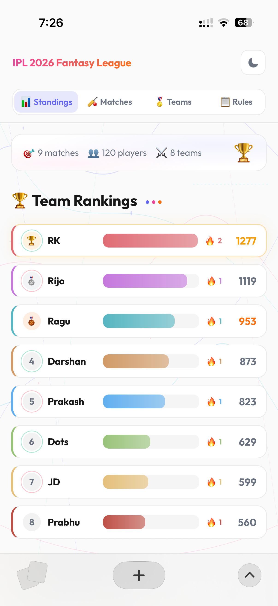
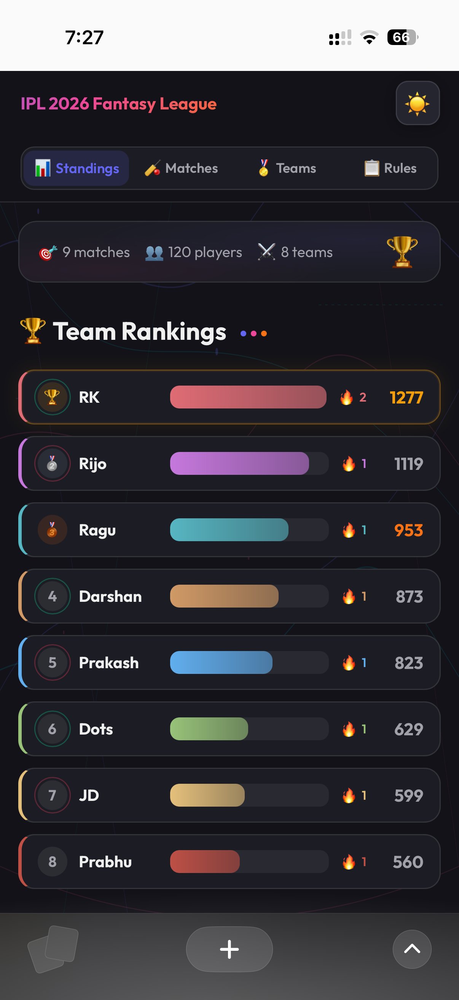
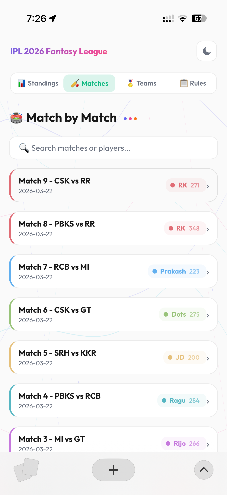
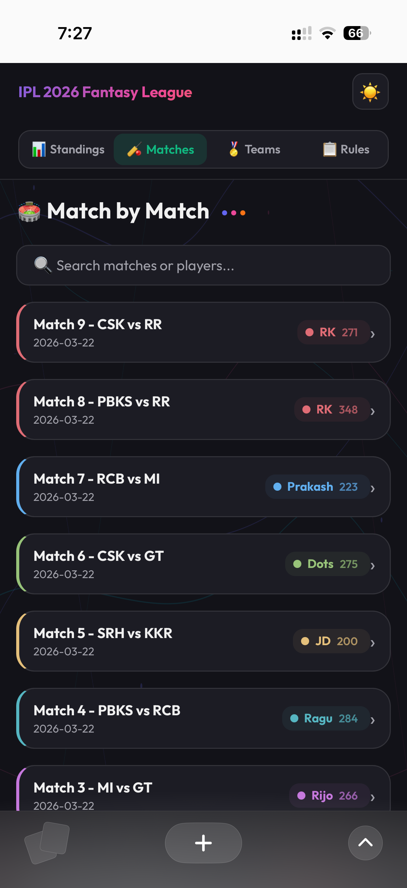
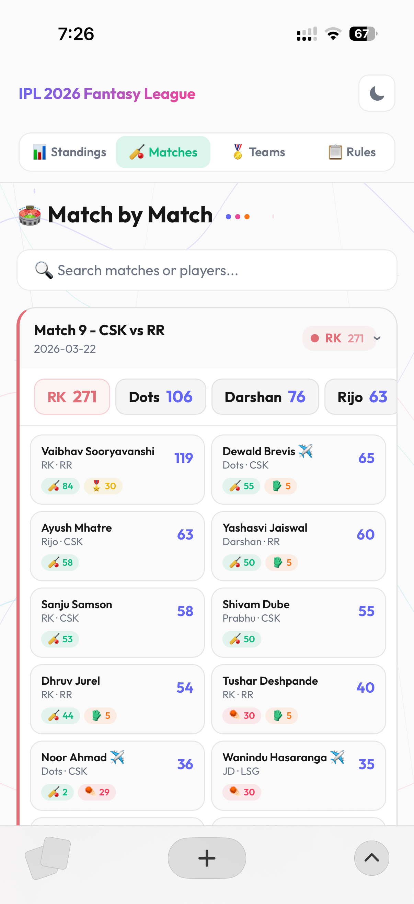
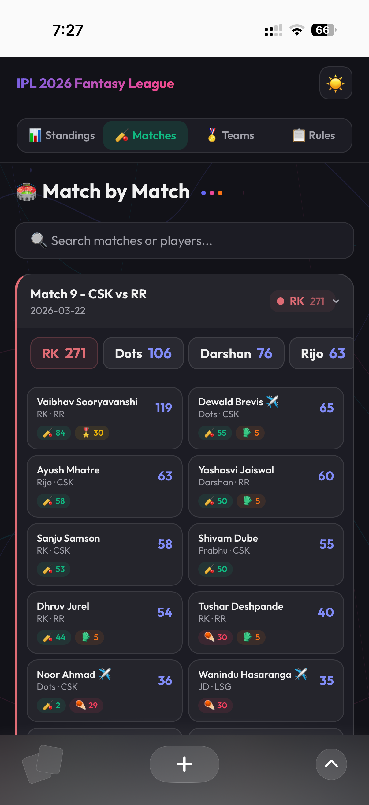
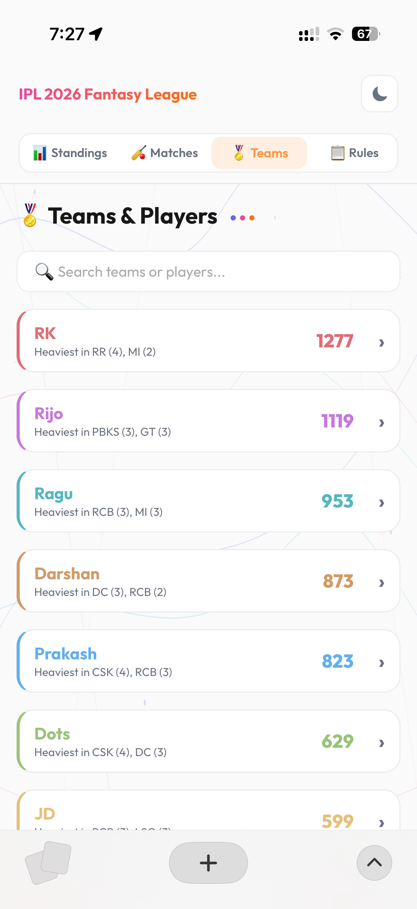
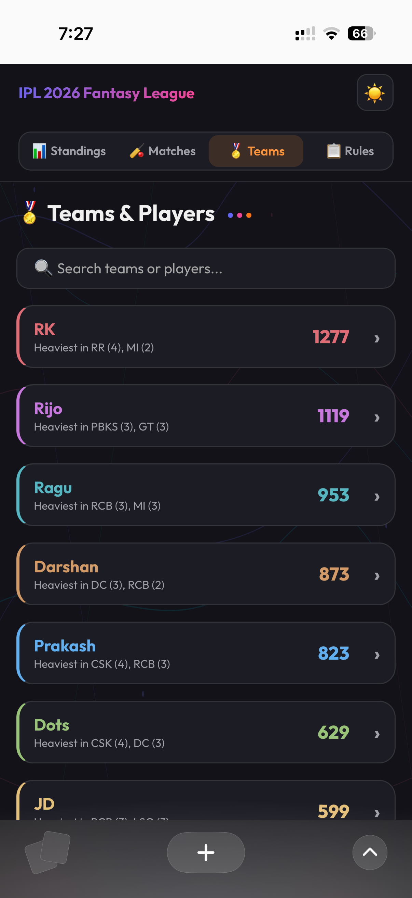

<p align="center">
  
  
  
</p>

<h1 align="center">🏏 Pavilion</h1>

<p align="center">
  A self-hosted fantasy cricket league tracker.<br/>
  Fork it, add your players, deploy — your league, your rules.
</p>

<br/>

## Screenshots

<p align="center">
  
  
  
  
</p>

<p align="center">
  
  
  
  
</p>

<br/>

---

<br/>

## 📋 Table of Contents

- [Screenshots](#screenshots)
- [How It Works](#-how-it-works)
- [Quick Start](#-quick-start)
- [Setting Up Your League](#-setting-up-your-league)
- [Adding a Match Score](#-adding-a-match-score)
- [CSV Format Reference](#-csv-format-reference)
- [Scoring Rules](#-scoring-rules)
- [Project Structure](#-project-structure)
- [Deployment](#-deployment)

<br/>

---

<br/>

## 💡 How It Works

Each deployed instance of Pavilion is **one league**. Your friend group forks this repo, adds their own player roster, and deploys to Netlify. That's it — no accounts, no databases, no shared infrastructure.

- **Players** are defined in `data/players-cache.json`
- **Matches** are added as CSV files in `data/matches/`
- **League name** is set in `data/config.json`
- **Scoring** happens automatically based on the CSV data

Push a match CSV → the site updates live.

<br/>

---

<br/>

## 🚀 Quick Start

```bash
# 1. Clone the repo
git clone https://github.com/iambalabharathi/Pavilion.git
cd Pavilion

# 2. Install dependencies
npm install

# 3. Start the dev server
npm start
```

Open **http://localhost:3001** and you're good to go.

<br/>

---

<br/>

## 🎯 Setting Up Your League

Before anything else, you need to configure two files:

<br/>

### 1. Player Roster — `data/players-cache.json`

This is the heart of your league. It's a JSON array where each player looks like this:

```json
[
  {
    "id": 13,
    "name": "Shubman Gill",
    "category": "Batter",
    "iplTeam": "GT",
    "foreign": "Indian",
    "fantasyTeam": "Ragu",
    "soldPrice": 18
  },
  {
    "id": 20,
    "name": "Rinku Singh",
    "category": "Batter",
    "iplTeam": "KKR",
    "foreign": "Indian",
    "fantasyTeam": "Ragu",
    "soldPrice": 11
  }
]
```

<br/>

**Field reference:**

| Field | Required | Description |
|-------|----------|-------------|
| `id` | Yes | Unique player ID (used to match CSV rows) |
| `name` | Yes | Player's display name |
| `fantasyTeam` | Yes | Which fantasy team owns this player |
| `category` | No | `Batter`, `Bowler`, `All-rounder`, or `Wicketkeeper` |
| `iplTeam` | No | IPL franchise code (`CSK`, `MI`, `RCB`, etc.) |
| `foreign` | No | `Indian` or `Overseas` |
| `soldPrice` | No | Auction price |

<br/>

> **Tip:** The repo already includes a sample roster at `data/players-cache.json` with 120+ players across 8 fantasy teams. You can use it as a reference or replace it entirely with your own.

<br/>

Teams are **auto-detected** from the `fantasyTeam` field — no need to list them separately.

<br/>

### 2. League Name — `data/config.json`

A simple file that sets your league's display name:

```json
{
  "name": "IPL 2026 Fantasy League"
}
```

Change this to whatever you want — it shows up in the header and browser tab.

<br/>

### 3. Deploy

Once both files are in place, commit and push. The site loads directly into the dashboard — no setup screens, no configuration UI.

<br/>

---

<br/>

## 🏏 Adding a Match Score

This is the main thing you'll be doing after the league is set up.

There are two ways to add a match:

<br/>

### Method 1: From Cricbuzz Scorecard (Recommended)

This parses a raw scorecard text file and auto-generates the CSV.

<br/>

**Step 1** — Create a raw text file in `data/raw/`:

```
data/raw/match-10.txt
```

<br/>

**Step 2** — Go to the **Cricbuzz scorecard** for the match. Copy the **full batting + bowling tables** for both innings and paste them into the file. It should look like this:

```
Chennai Super Kings  (20 ovs maximum)
Batting	 	R	B	M	4s	6s	SR
Ayush Mhatre
c Maphaka b Deshpande
43	20	29	8	1	215.00
Devon Conway
c Jurel b Yudhvir Singh
10	8	7	2	0	125.00
...

Bowling	O	M	R	W	NB	WD	ECO
Tushar Deshpande 	4	0	47	1	0	1	11.75
Trent Boult 	4	0	51	0	1	0	12.75
...
```

> **Tip:** Copy from the Cricbuzz page starting from the team name heading, through both innings (batting + bowling for each team).

<br/>

**Step 3** — Run the parser:

```bash
node parse-match.js data/raw/match-10.txt
```

This creates `data/matches/match-10.csv` with all stats filled in.

> Use `--force` to overwrite an existing match file:
> ```bash
> node parse-match.js data/raw/match-10.txt --force
> ```

<br/>

**Step 4** — Review the generated CSV, then commit & push:

```bash
git add data/
git commit -m "Match 10 data added"
git push
```

The site auto-deploys on Netlify after push.

<br/>

---

<br/>

### Method 2: Generate Template & Fill Manually

If you prefer to fill in stats yourself from the scorecard:

<br/>

**Step 1** — Generate a blank match template:

```bash
node generate-match.js <team1> <team2> <matchNumber>
```

Example:

```bash
node generate-match.js CSK MI 10
```

**Valid IPL teams:** `CSK`, `DC`, `GT`, `KKR`, `LSG`, `MI`, `PBKS`, `RCB`, `RR`, `SRH`

This creates `data/matches/match-10.csv` with all players from both teams, stats set to `0`.

<br/>

**Step 2** — Open the CSV and fill in stats from the Cricbuzz scorecard:

```
# CSK vs MI - Match 10
# 2026-04-05
#
# id, name, ipl_team, fantasy_team, playing, mom, runs, 4s, 6s, wkts, dots, maidens, lbw_b_hw, catches, ro_direct, ro_indirect, stumpings

# --- CSK ---
1, MS Dhoni, CSK, Ragu, 1, 0, 45, 3, 2, 0, 0, 0, 0, 1, 0, 0, 0
2, Ravindra Jadeja, CSK, Dots, 1, 1, 32, 2, 1, 2, 8, 0, 1, 1, 0, 0, 0
...
```

<br/>

**Step 3** — Commit & push:

```bash
git add data/matches/match-10.csv
git commit -m "Match 10 data added"
git push
```

<br/>

---

<br/>

## 📄 CSV Format Reference

Each match is a CSV file at `data/matches/match-<N>.csv`.

<br/>

### Header comments

| Line | Purpose | Example |
|------|---------|---------|
| Line 1 | `# <Title>` | `# RCB vs PBKS - Match 1` |
| Line 2 | `# <Date>` | `# 2026-03-22` |

<br/>

### Columns

| Column | Description | Values |
|--------|-------------|--------|
| `id` | Player ID (from `players-cache.json`) | Integer |
| `name` | Player name | String |
| `ipl_team` | IPL franchise | `CSK`, `MI`, `RCB`, etc. |
| `fantasy_team` | Fantasy team owner | `Ragu`, `RK`, `Darshan`, etc. |
| `playing` | In Playing 12? | `1` = yes, `0` = no |
| `mom` | Man of the Match? | `1` = yes, `0` = no |
| `runs` | Runs scored | Integer |
| `4s` | Number of fours | Integer |
| `6s` | Number of sixes | Integer |
| `wkts` | Wickets taken | Integer |
| `dots` | Dot balls bowled | Integer |
| `maidens` | Maiden overs | Integer |
| `lbw_b_hw` | LBW / Bowled / Hit-wicket dismissals | Integer |
| `catches` | Catches taken | Integer |
| `ro_direct` | Direct hit run-outs | Integer |
| `ro_indirect` | Indirect/shared run-outs | Integer |
| `stumpings` | Stumpings | Integer |

<br/>

### Special cases

- **Abandoned match** — Add `# abandoned` as a comment line. All points become 0.

- **Players not in Playing 12** — Keep `playing` as `0`. They get 0 points.

- **Man of the Match** — Set `mom` to `1` for the winner.

<br/>

---

<br/>

## 🏆 Scoring Rules

<br/>

### Batting

| Criteria | Points |
|----------|--------|
| Each Run | 1 pt |
| Each Four | +1 pt bonus |
| Each Six | +2 pts bonus |
| 30+ Runs | +5 pts |
| 50+ Runs | +10 pts |
| 100+ Runs | +10 pts |

<br/>

### Bowling

| Criteria | Points |
|----------|--------|
| Each Dot Ball | 1 pt |
| Each Wicket | 20 pts |
| 2+ Wickets | +5 pts |
| 3+ Wickets | +10 pts |
| 5+ Wickets | +10 pts |
| Each Maiden Over | 20 pts |
| LBW / Bowled / Hit-wicket | +5 pts each |

<br/>

### Fielding

| Criteria | Points |
|----------|--------|
| Each Catch | 5 pts |
| Direct Run-out | 10 pts |
| Indirect Run-out | 5 pts |
| Each Stumping | 10 pts |

<br/>

### Bonus

| Criteria | Points |
|----------|--------|
| In Playing 12 | 5 pts |
| Man of the Match | 30 pts |

<br/>

### Other rules

- Points calculated for all IPL matches until the Final

- Super over points are **NOT** counted

- Abandoned match = 0 points for the entire match

- All stats sourced from **Cricbuzz Scorecard**

<br/>

---

<br/>

## 📁 Project Structure

```
Pavilion/
├── public/
│   └── index.html              # Single-page app (all frontend code)
│
├── data/
│   ├── config.json             # League name
│   ├── players-cache.json      # Player roster (the main config file)
│   ├── matches/
│   │   ├── match-1.csv         # Match data files
│   │   ├── match-2.csv
│   │   └── ...
│   └── raw/                    # Raw Cricbuzz scorecard text files
│       ├── match-1.txt
│       └── ...
│
├── netlify/
│   └── functions/
│       └── api.js              # Serverless API for Netlify
│
├── server.js                   # Local Express dev server
├── generate-match.js           # CLI: Generate blank match CSV
├── parse-match.js              # CLI: Parse Cricbuzz scorecard → CSV
├── netlify.toml                # Netlify deploy config
└── package.json
```

<br/>

---

<br/>

## 🌐 Deployment

The site auto-deploys to **Netlify** on every push to `main`.

<br/>

**Netlify settings:**

| Setting | Value |
|---------|-------|
| Base directory | *(leave blank)* |
| Build command | *(leave blank)* |
| Publish directory | `public` |
| Functions directory | `netlify/functions` |

<br/>

**What gets deployed:**

- **Frontend** — Static files from `public/`
- **API** — Serverless functions in `netlify/functions/`
- **Data** — Player roster + match CSVs bundled with every deploy

<br/>

Just push your changes and the live site updates automatically.

<br/>

---

<br/>

<p align="center">
  <sub>Built with ❤️ — Pavilion</sub>
</p>
